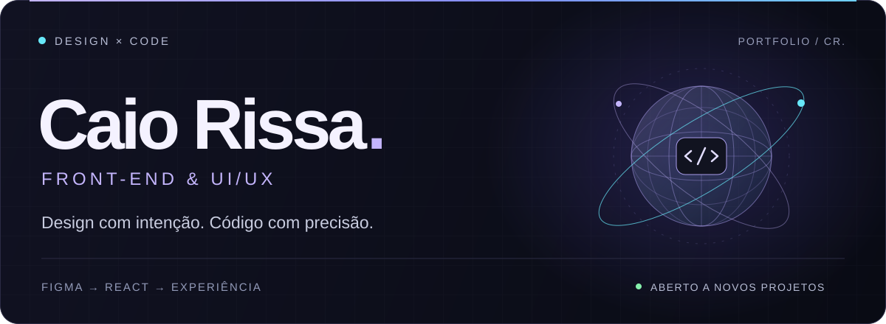
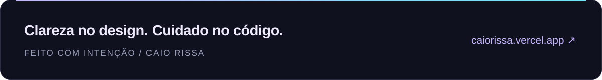

  

  
  
  
  

  RIO GRANDE DO SUL, BRASIL &nbsp; / &nbsp; FRONT-END &amp; UI/UX &nbsp; / &nbsp; DISPONÍVEL PARA PROJETOS

 

## `01` &nbsp; Design encontra código

Sou **Caio Rissa Silveira**. Transformo ideias e problemas complexos em interfaces claras, responsivas e naturais de usar. Meu trabalho conecta a intenção do design à experiência de quem está do outro lado da tela.

Do **Figma ao React**, cuido da hierarquia visual, das interações e da performance. Sou também cofundador da **[Loomee AI](https://loomeeai.com/)**, estúdio independente de sites e landing pages sob medida.

> Cada elemento tem um propósito. Cada interação faz parte da experiência.

 

## `02` &nbsp; Meu toolkit

  
  
  
  
  
  
  

**Interfaces** &nbsp; Componentes consistentes · Design responsivo · Semântica e acessibilidade 
**Experiência** &nbsp; UI/UX · Prototipação · Microinterações · Hierarquia visual

 

## `03` &nbsp; Projetos & estúdio

Uma seleção do meu trabalho em design de interface e desenvolvimento front-end.

<table>
  <tr>
    <td width="50%" valign="top">
      <h3>↗ Fyzen</h3>
      
PRODUTO FITNESS

      
Treinos personalizados a partir do perfil e da experiência de cada pessoa. Uma interface para conectar rotina, movimento e evolução.

      
<code>React</code> <code>JavaScript</code> <code>Tailwind CSS</code>

      
<a href="https://fyzen.app/"><strong>Explorar projeto →</strong></a>

    </td>
    <td width="50%" valign="top">
      <h3>↗ Riegel Films</h3>
      
PORTFÓLIO AUDIOVISUAL

      
Narrativa visual, filmes em destaque e apresentação de serviços. Uma experiência que coloca o trabalho audiovisual no centro.

      
<code>React</code> <code>JavaScript</code> <code>Tailwind CSS</code>

      
<a href="https://riegelfilms.com/"><strong>Explorar projeto →</strong></a>

    </td>
  </tr>
  <tr>
    <td width="50%" valign="top">
      <h3>↗ Ventlize</h3>
      
SITE INSTITUCIONAL

      
Presença digital com foco em clareza, apresentação da empresa e novas oportunidades de negócio.

      
<code>React</code> <code>JavaScript</code> <code>Tailwind CSS</code>

      
<a href="https://ventlize-site.vercel.app/"><strong>Explorar projeto →</strong></a>

    </td>
    <td width="50%" valign="top">
      <h3>✳ Loomee AI</h3>
      
ESTÚDIO INDEPENDENTE · COFUNDADOR

      
Sites e landing pages sob medida. Da estratégia ao lançamento, com design no Figma e código próprio.

      
<code>Figma</code> <code>React</code> <code>UX</code>

      
<a href="https://loomeeai.com/"><strong>Conhecer o estúdio →</strong></a>

    </td>
  </tr>
</table>

 

## `04` &nbsp; Interface lab

Estudos autorais e conceitos para experimentar novas direções visuais e explorar produtos de diferentes segmentos.

| Experimento | Universo | Stack / foco | Explore |
| :--- | :--- | :--- | :--- |
| **NEXA** | Finanças, patrimônio e investimentos | Product Design · Dashboard · UI responsiva | [Demo ↗](https://nexa-jade-theta.vercel.app/) |
| **Gentelman's Cut** | Barbearia premium e reservas | React · Tailwind CSS · Motion | [Demo ↗](https://mockup-barbearia.vercel.app/) · [Código](https://github.com/caiorissa/mockup-barbearia) |
| **VÉRTEX Performance Club** | Gestão e operação de academias | React · TypeScript · Recharts | [Demo ↗](https://mockup-academia.vercel.app/) · [Código](https://github.com/caiorissa/mockup-academia) |
| **Horizonte CRM** | Funil comercial e gestão imobiliária | React · TypeScript · Recharts | [Demo ↗](https://mockup-imobiliaria.vercel.app/) · [Código](https://github.com/caiorissa/mockup-imobiliaria) |

 

## `05` &nbsp; Vamos construir o próximo?

Um site, uma landing page ou a interface do seu produto. Vamos transformar sua ideia em uma experiência que faça sentido.

**[Conversar no WhatsApp ↗](https://wa.me/5551994210879)** &nbsp; ou &nbsp; **[caiorissa@gmail.com](mailto:caiorissa@gmail.com)**

[LinkedIn](https://www.linkedin.com/in/caio-rissa-b4706527a/) &nbsp; / &nbsp; [Instagram](https://www.instagram.com/caaiio.dev/) &nbsp; / &nbsp; [X](https://x.com/caiorissa) &nbsp; / &nbsp; [Portfólio completo](https://caiorissa.vercel.app/)

 

  

